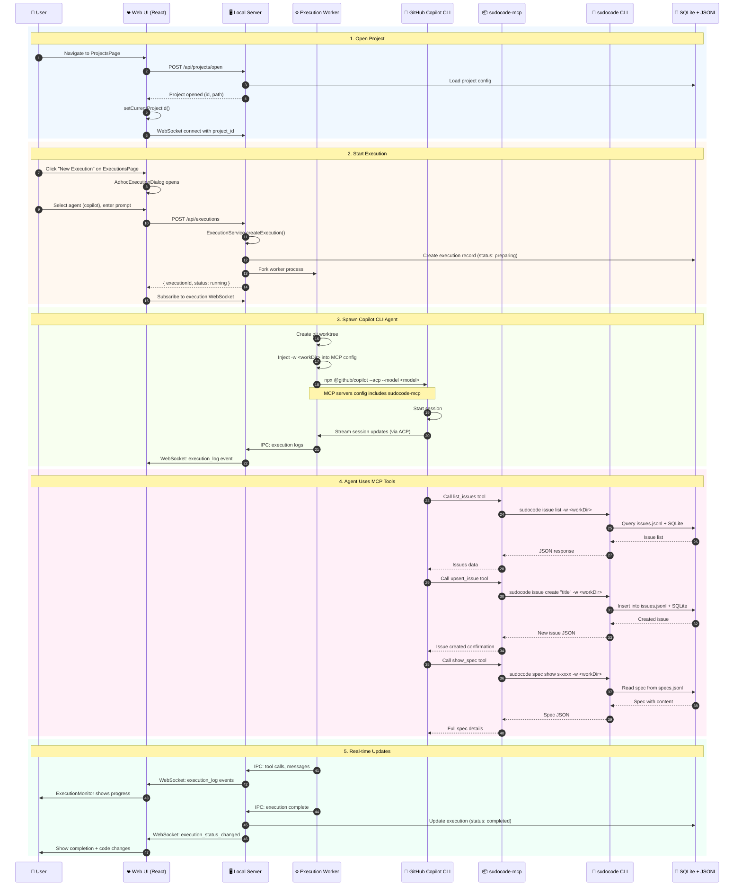

# Web UI → Copilot CLI → MCP Tools Flow

This document explains how the sudocode Web UI enables users to run GitHub Copilot CLI executions that can interact with specs and issues via MCP tools.

## Sequence Diagram

## Key Components

| Layer | Component | Purpose |
|-------|-----------|---------|
| **Frontend** | `ProjectsPage` | Browse/open projects from filesystem |
| **Frontend** | `ExecutionsPage` | Start/monitor agent executions |
| **Frontend** | `WebSocketContext` | Real-time updates per project |
| **Server** | `ExecutionService` | Orchestrates execution lifecycle |
| **Server** | `execution-worker.ts` | Isolated worker process per execution |
| **Agent** | `CopilotAdapter` | Builds CLI args for `@github/copilot` |
| **MCP** | `sudocode-mcp` | Exposes `list_issues`, `upsert_issue`, `show_spec`, etc. |
| **CLI** | `sudocode` | Reads/writes JSONL files + SQLite cache |

## Critical Path for MCP Tool Access

1. **Worker injects `-w <worktree_path>`** into `sudocode-mcp` args
2. **MCP server uses that working directory** for all CLI commands
3. This ensures the agent operates on the **correct project's specs/issues**

## Flow Breakdown

### 1. Open Project

The user navigates to the ProjectsPage and selects a project to open. The frontend calls `POST /api/projects/open` which loads the project configuration and returns a project ID. The frontend stores this in `ProjectContext` and establishes a WebSocket connection scoped to that project.

### 2. Start Execution

From the ExecutionsPage, the user clicks "New Execution" which opens `AdhocExecutionDialog`. They select an agent type (e.g., `copilot`) and enter a prompt. The frontend sends `POST /api/executions` which:

- Creates an execution record in the database
- Forks an isolated worker process
- Returns immediately with the execution ID

### 3. Spawn Copilot CLI Agent

The execution worker:

1. Creates a git worktree for isolation
2. Injects the working directory into MCP server configuration
3. Spawns the Copilot CLI via `npx @github/copilot --acp`
4. Streams session updates back to the server via IPC

### 4. Agent Uses MCP Tools

The Copilot agent can call sudocode MCP tools like:

| Tool | CLI Command | Purpose |
|------|-------------|---------|
| `list_issues` | `sudocode issue list` | Get all issues |
| `upsert_issue` | `sudocode issue create/update` | Create or update issues |
| `show_spec` | `sudocode spec show` | Get spec details |
| `list_specs` | `sudocode spec list` | Get all specs |
| `upsert_spec` | `sudocode spec create/update` | Create or update specs |
| `ready` | `sudocode ready` | Get ready work items |
| `link` | `sudocode link` | Create relationships |
| `add_feedback` | `sudocode feedback add` | Add anchored feedback |

### 5. Real-time Updates

All agent activity streams to the frontend via WebSocket:

- `execution_log` events show progress in `ExecutionMonitor`
- `execution_status_changed` events update the execution list
- Code changes are tracked and displayed in `CodeChangesPanel`

## Related Files

- [frontend/src/pages/ProjectsPage.tsx](../frontend/src/pages/ProjectsPage.tsx) - Project selection UI
- [frontend/src/pages/ExecutionsPage.tsx](../frontend/src/pages/ExecutionsPage.tsx) - Execution management UI
- [server/src/workers/execution-worker.ts](../server/src/workers/execution-worker.ts) - Worker process
- [server/src/execution/adapters/copilot-adapter.ts](../server/src/execution/adapters/copilot-adapter.ts) - Copilot CLI adapter
- [mcp/src/server.ts](../mcp/src/server.ts) - MCP server implementation
- [mcp/src/tools/issues.ts](../mcp/src/tools/issues.ts) - Issue MCP tools
- [mcp/src/tools/specs.ts](../mcp/src/tools/specs.ts) - Spec MCP tools
